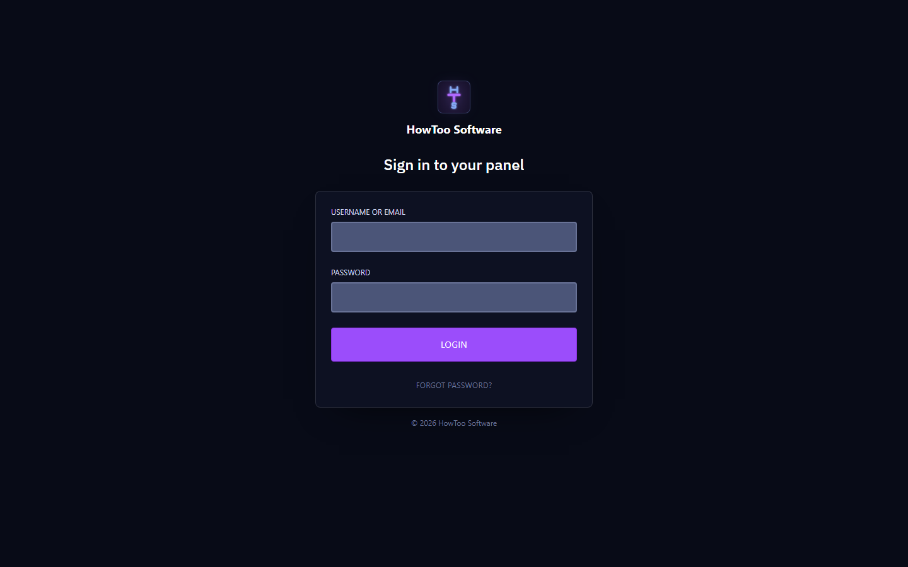
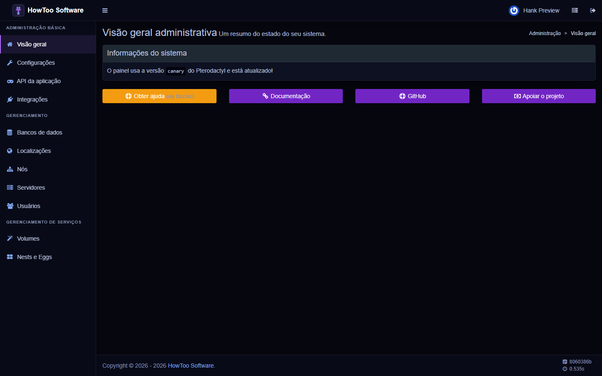
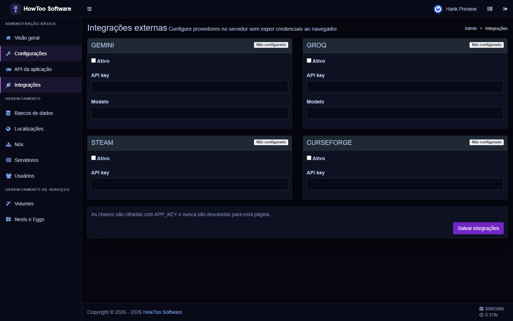
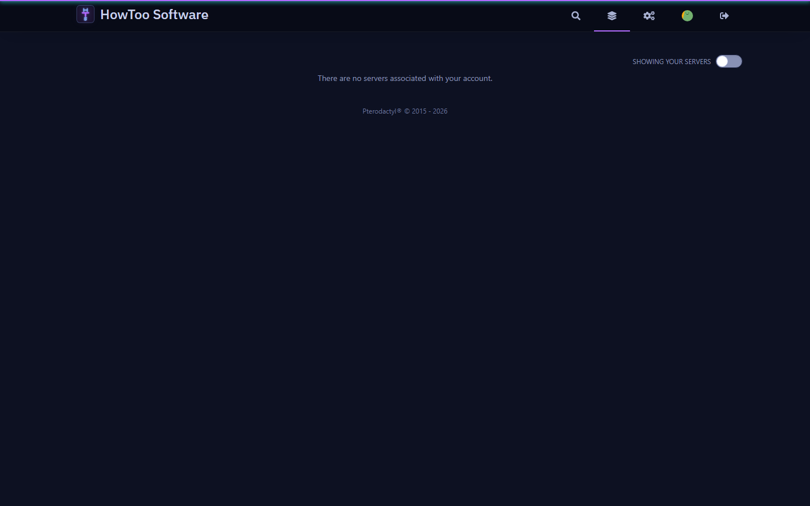

<p align="center">
  
</p>

# HowToo Software Panel

Customizacao operacional do [Pterodactyl Panel](https://github.com/pterodactyl/panel), baseada na versao `1.15.1`.
O projeto preserva o backend, a autenticacao, as permissoes, os websockets e as rotas oficiais do Pterodactyl e aplica a identidade e as extensoes HowToo diretamente sobre essa base.

Este repositorio nao e um prototipo HTML e nao cria servidores de demonstracao. A lista de servidores exibida ao usuario vem exclusivamente do banco do Pterodactyl e das Wings conectadas.

## Interface

| Portugues automatico | English automatic |
| --- | --- |
|  |  |

| Administracao | Integracoes externas |
| --- | --- |
|  |  |



O dashboard acima usa o estado vazio real do Pterodactyl. Nenhum servidor foi criado apenas para as capturas; cards e dados aparecem somente depois que servidores reais forem associados ao usuario.

O idioma e detectado pelo `Accept-Language` do navegador. Navegadores em portugues usam `pt`; os demais recebem `en`, que tambem e o fallback.

## Implementado

- Base completa do Pterodactyl, incluindo login, 2FA, perfil, API, SSH, atividade, administracao, servidores, arquivos, bancos, agendamentos, usuarios, backups, rede, inicializacao e console.
- Navegacao lateral HowToo dentro de cada servidor, usando os componentes e as permissoes reais do Pterodactyl.
- Tema HowToo responsivo em React e no painel administrativo Blade.
- Localizacao automatica em portugues e ingles, inclusive no carregamento agrupado do i18next.
- Cadastro administrativo de credenciais para Gemini, Groq, Steam e CurseForge.
- Segredos criptografados com `APP_KEY`, nunca preenchidos novamente no HTML e acessiveis apenas pelo backend.
- URLs externas fixadas no servidor para reduzir risco de SSRF por configuracao administrativa.

As credenciais cadastradas formam a base segura das integracoes. Clientes de IA, busca e instalacao devem ser implementados como servicos Laravel server-side; chaves de API nunca devem ser enviadas ao React ou as Wings.

## Arquitetura

- `app/`, `routes/`, `database/`: backend Laravel e regras oficiais do Pterodactyl.
- `resources/scripts/`: cliente React oficial com tema e navegacao HowToo.
- `resources/views/admin/`: painel administrativo Blade com tema HowToo.
- `app/Services/HowToo/`: servicos exclusivos da plataforma.
- `config/howtoo.php`: configuracao server-side das integracoes.
- `resources/lang/en` e `resources/lang/pt`: traducoes suportadas.
- `docs/ARCHITECTURE.md`: limites da customizacao e fluxo de dados.

## Instalacao

Use os mesmos requisitos da [documentacao oficial do Pterodactyl](https://pterodactyl.io/panel/1.0/getting_started.html): PHP, MySQL/MariaDB, Redis, um servidor web e Wings nos nos de execucao.

```bash
cp .env.example .env
composer install --no-dev --optimize-autoloader
php artisan key:generate --force
php artisan migrate --seed --force
corepack yarn install --frozen-lockfile
corepack yarn build:production
php artisan optimize
```

Configure banco, Redis, email e dominio no `.env`. Em producao, mantenha `APP_DEBUG=false`, proteja o arquivo `.env` e execute fila e agendador conforme a documentacao oficial.

As credenciais externas podem ser definidas no `.env` inicialmente ou pelo menu **Administracao > Integracoes**. Valores salvos pelo painel sao criptografados no banco com a chave da aplicacao.

## Desenvolvimento

```bash
composer install
corepack yarn install --frozen-lockfile
corepack yarn tsc
corepack yarn build
php artisan serve
```

Os testes PHP dependem de um MySQL de teste configurado. Nunca execute a suite contra um banco de producao.

## Atualizacoes do Pterodactyl

Atualizacoes do upstream devem ser integradas e revisadas, nao substituidas por uma nova interface desconectada. Preserve os middlewares de autenticacao, os `PermissionRoute`, o `ServerContext`, os listeners de instalacao/transferencia e o websocket oficial ao resolver conflitos.

## Licenca

O Pterodactyl e distribuido sob a [licenca MIT](LICENSE.md). As customizacoes HowToo neste fork seguem os mesmos termos, mantendo os avisos de copyright do projeto original.
